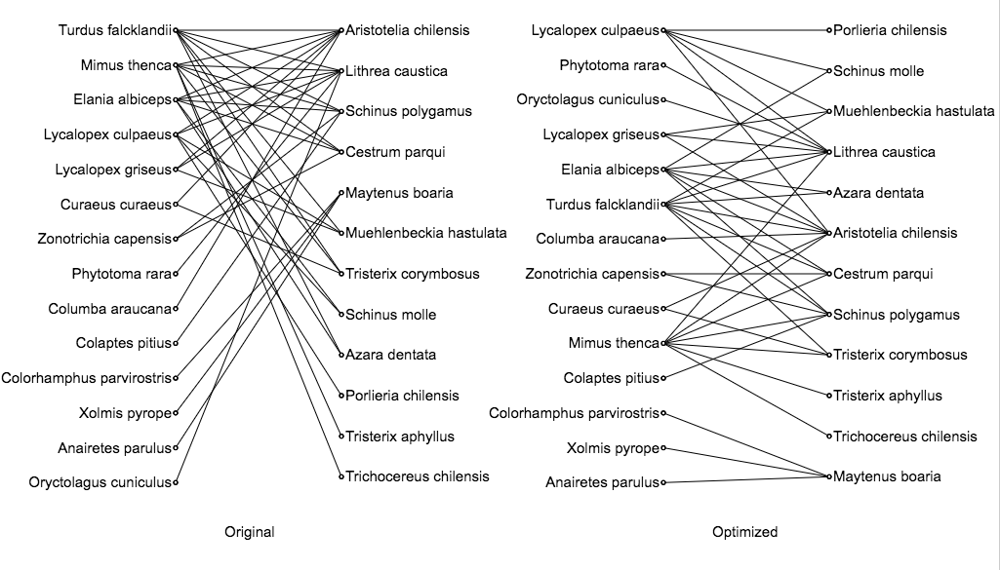

# Introducción

Many kinds of information can be represented by graphs. We often look at the relationships between two sets of data to analyze information. For example, the relationships between customers and goods are studied to understand buying patterns, and relationships between web pages and visNaudrs are studied to gain more understanding of website usages. Graphs representing such relationships are called bipartite graphs. Visualizing graph structures is one efficient analysis methods. We understand many-to-many relation-ships by visualizing bipartite graphs. However, although we can see overviews, understanding details of the information is difficult when large-scale bipartite graphs are visualized by conventional techniques [@Zheng2005], [@DiGiacomo2007], [@Newton2002]. <!-- @Naud2010 -->

Bipartite graphs, which represent relations between entities in two disjoint sets, can be found in many application domains. Similar to the general graphs, bipartite graphs can be drawn as node-link diagrams or matrices. For node-link diagrams, one common practice is to assign disjoint drawing space to ensure visual separation of the two sets of nodes and arrange the nodes within the spaces to achieve the esthetic goal of minimizing edge crossings or edge lengths. For example, the nodes can be placed on two parallel axis [@Schulz2008], or two concentric spheres [@Naud2007; @Dumas2012], or two tables [@Schulz2008; @John2013]. Another drawing style for bipartite graphs restricts the nodes in one set to fixed positions (hence ‘‘anchors’’) and treating nodes in another set as ‘‘free nodes’’ which can be placed using force-directed model [@Misue2006; @Thiel2007].

## Motivación

## Descripción de problema

The purpose of this research is visualization of the relations represented by bipartite graphs. In particular, its target is to facilitate an understanding of the node clusters’ meaning and the relationships among the clusters. In the examples mentioned above, we expect that bipartite graphs can help us to understand the relational structures such as the scale of clusters of similar goods, the relationships among clusters of goods, and the relationships among clusters of goods and customers. <!-- @Misue2006 -->

## Areas de aplicación

Bipartite graphs can be found in various fields. Examples include graphs that show relationships between documents and the words included in them, graphs that show relationships between customers and goods they bought, and graphs that show relationships between communities and their members. <!-- @Misue2006 -->

Such relationships are often used to compute similarities. For example, when customer A and customer B have bought a lot of the same goods, we may think that A and B share similar properties. On the other hand, when a lot of customers bought goods X together with goods Y, we may think X and Y have some similarities. Such similarities are used for information retrieval, E-commerce recommendations, and so on. <!-- @Misue2006 -->

Bipartite graph visualizations have been used for showing relations between keywords of publications and the corresponding years of publication to show the topic shifts overtime [@Thiel2007], or show the relationship between words and other entities like research teams or documents [@Naud2007] in order to make the research literature more understandable. <!-- @Hong2005 -->

In many application domains, we encounter data which involves a graph encoding certain rela- tionships and a set of items related to the graph. One example is in social websites where the users interact with each other, and share their interests on different items such as music or books. In this case, the direct interactions among the users can be represented as a graph, and the items like music or books can be represented as a set. People are often interested in the bipartite relation between the graph and the set. They might want to know the similarity or difference of the items liked by themselves and by their friends. <!-- @Hong2005 -->

Many applications involve a network of objects and a set of items related to those objects. For example, friends in the Facebook form social networks. Some friends may share their favorite music or books; some friends may follow different topics. Researchers form collaboration networks by co-authoring papers but they often have different research interests. Trade relationships among countries or cities are also networks, and a set of goods are related to the countries or cities. Hyperlinks among Internet webpages build networks with different or similar features in webpages. <!-- @Hong2005 -->

In these applications, people are often interested in the bipartite relationships between the network and the set of items (e.g., books, topics, interests). One possible scenario is that people often want to know the interests of their friends, how diverse their interests are, and what kind of interests they possibly share. People may explore their social network and ask questions like who have similar interests with me but are not my close friends yet? who have much broad interests than me? which friends have quite different interests from mines? Or they can start from the items in the set, select some items, and ask who are interested in these items and what are their relationships. They may also want some suggestions for similar items based on what they already have. Another possible scenario is that a person may want to know the import/export goods of the countries traded with her/his mother country, and what kind of goods these countries may share. <!-- @Hong2005 -->

Bipartite graphs have a wonderful property that their vertices can be divided into two parts such that no two vertices which are in same part are joined by an edge[1].This property can lead to several applications of bipartite graph. The first systematic investigation on Bi-graph was started by Konig (1914). Bi-graph are natural mathematical models which can represent a practical context where two different types of objects interact such as jobs and workers, telephone exchanges and cities.
For instance, a graph of football players and clubs, with an edge between a player and a club if the player has played for that club, is a natural example of an affiliation network, a type of bipartite graph used in social network analysis.  <!-- @Arunkumar2015 -->

Bipartite graphs are extensively used in modern coding theory, especially to code words received from the channel. Factor graphs and Tanner graphs are examples of this. A Tanner graph is a bipartite graph in which the vertices on one side of the bipartition represent digits of a codeword, and the vertices on the other side represent combinations of digits that are expected to sum to zero in a codeword without errors. A factor graph is a closely related belief network used for probabilistic decoding of LDPC and turbo codes. <!-- @Arunkumar2015 -->

Bipartite matching can be used to solve a problem to determine which couples are compatible for marriage (man/woman), example: (Rama, Sita),(Shiva,Parvati). Problem is to maximize the number matches,neither polygamy nor polyandry are allowed. Each vertex can be assigned only one vertex of the other group. This problem can be solved by solve this problem by creating a flow network out of a bipartite graph.
Bipartite graph can be used in the medical field in the detection of lung cancer, throat cancer etc <!-- @Arunkumar2015 -->

Bipartite graph can mathematical model the common situations as well as serious problems in the several areas of wireless networks including cognitive radio networks, big data and cloud computing. Therefore, one can understand that it is desire of the researcher to apply the graph theory structures such as bi-graph in their works. Theoretical bi-graphs appears to be very simple but with all the complexities of the general principles of graph theory embodiment in it. This work has done an extensive literature analysis and found that bi-graphs are not much discussed and applied much in the specific context of cloud computing. <!-- @Arunkumar2015 -->

Cloud computing is an Internet-based computing [2]. It relies on sharing computing resources which are delivered as services on the Internet. Web service is one of the most important types of services that can be used in cloud computing. But many of them may be similar in some functional or nonfunctional properties, making how to recommend a suitable web service a problem facing many developers. Researchers have taken the QoS attributes into consideration. However, their research is on the premise that all the recommended web services are compatible, i.e., the recommended web services can be composed with existing web services. It may not always be true. In the paper [2],the compatibility of web services is taken into consideration, and presented a Bipartite Graph based Service Recommendation (BIGSIR) method to address the service compatibility problem. <!-- @Arunkumar2015 -->

The work in [2], BIGSIR uses the historical usage data of web services to recommend web services to developers. Different from existing web service recommendation approaches, BIGSIR adopts a bipartite graph to visual the web services and the relationship between them. Based on the graph model, an effective recommendation algorithm is introduced to recommend the suitable web services. The approach in [2] is evaluated on a dataset constructed from Experiment, a search engine that contains about 1,851 web services and 2,000 workflows. Experimental results demonstrate that apart from some isolated web services or workflows, BIGSIR can obtain promising results. This work not only provides a new dataset, but also highlights a new perspective for service recommendation, i.e. services as a bipartite network.
The work in [6], discusses on the implementation of—Map Reduce software which is a framework for processing data-intensive applications with a parallel manner in cloud computing systems. There are also an increasing number of Map Reduce jobs that require deadline guarantees. The existing deadline-concerning scheduling schemes do not consider the two problems in the Map Reduce computing environment: slot performance heterogeneity and job time variation. In this paper, the utilize the Bipartite Graph modeling to propose a new Map Reduce Scheduler called the BGMRS. The BGMRS can obtain the optimal solution of the deadline-constrained scheduling problem by transforming the problem into a well-known graph problem: minimum weighted bipartite matching. <!-- @Arunkumar2015 -->

# Antecedentes

## Trabajos relacionados

Although graph drawing is a very active field of research, very few work exist on the visualization of bipartite graphs. An interesting method called Anchor Maps [@Misue2006] has been proposed recently. It provides a visualization of the graph in a 2-dimensional space, proceeding in two steps: the items of the first subset of vertices VA are plotted on a circle, after which the vertices of the second subset VB are added to the plot by allocating them with respect to the vertices of VA. A different approach is proposed by Zheng et al. [@Zheng2005], in which a layout of points on two parallel planes is sought for, such that a view in three dimensions from which the number of observed crossings will be minimal. Drawing the vertices on planar curves, as proposed by Di Giacomo et al.[@DiGiacomo2007], is another interesting approach. Hong et al. proposed [@Hong2005] a layered drawing of bipartite graphs in 21/2 dimensions, thatis the vertices are allocated on two surfaces embedded in athree dimensional Euclidean space. <!--@Usui2007 -->

Zheng et al. [@Zheng2005] described two layout models for bipartite graphs and proved theorems of edge crossing for these models. Giacomo et al. [@DiGiacomo2007] proposed drawing bipartite graphs on two curves so that the edges do not cross. Newton et al. [@Newton2002] proposed new heuristics for two-sided bipartite graph drawing. These studies proposed algorithms to minimize edge crossing in the two-sided style or extended models but they did not consider large-scale bipartite graphs.

Misue [@Misue2006] described anchored maps as a drawing technique for large-scale bipartite graphs. In anchored maps, nodes in one set of a bipartite graph are called anchors and nodes in the other set are called free nodes. Anchors are arranged on a circumference at equal intervals and free nodes are arranged using the force-directed method [7]. Misue proposed an algorithm to decide the order of anchors by hull-climb. Similar styles are used in systems proposed by Thiel et al. [@Thiel] and Donovan et al. [@Donovan]. However, it becomes more difficult to understand details as the number of anchors arranged on the circumference increases, because the anchors’ arrangement approaches a straight line (Figure 6(a)). Our technique is an improvement over anchored maps because it represents overviews and details simultaneously.

Naud et al. [@Naud2007] developed the 3D-SE Viewer, in which bipartite graphs are arranged on concentric spheres in 3D space. We also developed a 3D visualization technique for bipartite graphs called sphere anchored maps [12], in which nodes in one set are arranged on a sphere. 3D visualization techniques increase the readability, although occlusion problems occur as a result of projecting. These techniques require interaction costs. To avoid these costs, we aim to develop a 2D visualization technique.

## Modelo de datos

Common requirements for drawing a bipartite graph are that the bipartition is highlighted in the visualization by representing the vertices on two distinct layers, the edges have as few bends as possible, and the number of edge crossings is minimized. A bipartite graph is a biplanar graph if it has a straight line crossing- free drawing where the vertices of a same partite set all lie along a same horizontal layer [@Eades1994]. Biplanar graphs have been independently characterized in [@Eades1994, @Harary1972, @Tomii1977]. Also, the problem of computing straight-line drawings of bipartite graphs with the vertices on two horizontal layers and minimum number of crossings has been well studied; see, e.g. [@DiBattista1999, @Kaufmann2001] for some basic references on this topic. <!-- @DiGiacomo2007 -->

The purpose of bipartite graph visualization is to display simultaneously two types of relationships: the similarities existing between items within each of two subsets, on the basis of the relationships defined by the graph edges. <!--@Usui2007 -->

A. Formal definition of a bipartite graph

A graph G is defined as G := {V,E}, where V is the set of vertices or nodes and E the set of edges. Graph G is undirected if the pairs in E are unordered. An undirected graph G is called a bipartite graph if there exist a partition of the vertex set V = VA ∪ VB, so that there is no edge in E connecting VA to VB. <!--@Usui2007 -->

For the purposes of this paper, a bipartite graph G = (U, L, E) consists of two sets U and L of vertices and a set E G U x L of edges. Note that a particular vertex bipartition U, L is specified in the definition of G. Hence references to G presume this specified partition. <!-- @Eades1994 -->

It is often useful to draw G so that the vertices of U (the “upper part”) and L (the “lower part”) are on horizontal lines & and At, respectively, with AU above 2,; the edges are drawn as open straight line segments between their endpoints as in Fig. 1. Once the y coordinates of the horizontal lines Ja and & are specified, a drawing of G is defined by giving an x coordinate for each vertex, as the y coordinates of the vertices of U and L are equal to the y coordinates of A, and &,, respectively. <!-- @Eades1994 -->

A drawing is biplanar if it has no edge crossings; a graph is biplanar if it has a biplanar drawing. In this paper we investigate the problem of finding, given a bipartite graph, a biplanar subgraph with a maximum number of edges. (The biplanar subgraph need not be induced.) We also study this problem when the positions of some or all of the vertices are prescribed.  <!-- @Eades1994 -->

Let G = (V1, V2, E) be a bipartite graph. A 2-layer drawing of G has a fan crossing if there exist two adjacent edges that are both crossed by a third edge; we say that the three edges involved in the fan crossing form a fan crossing. For a given 2-layer drawing of G, denote by li the horizontal line on which the vertices of Vi are drawn (i = 1,2). We always assume that l1 is above l2. Two 2-layer drawings of G are equivalent if they have the same left-to-right order πi of the vertices of Vi (i = 1, 2) along li . A 2-layer embedding is an equivalence class of 2-layer drawings and it is described by a pair of linear orderings (i.e., permutations) γ = (π1 , π2 ) of the vertices in V1 and V2 , respectively. If Γ is a drawing within class γ , we also say that γ is the embedding of Γ .
Let Γ1 and Γ2 be 2-layer drawings of G with the same embedding γ . Two edges e and e′ cross in Γ1 if and only if they cross in Γ2. We say that embedding γ has a crossing at edges e and e′. Also, three edges e, e′ and e′′ form a fan crossing in Γ1 if and only if they form a fan crossing in Γ2. Correspondingly, we say that embedding γ has a fan crossing at edges e, e′, and e′′. Let γ = (π1, π2) be a 2-layer embedding of a bipartite graph G. The first vertex of π1 and the first vertex of π2 are called the leftmost vertices of γ ; the last vertex of π1 and the last vertex of π2 are called the rightmost vertices of γ . <!-- @DiGiacomo2012 -->

In the mathematical field of graph theory, a bipartite graph (or bigraph) is a graph whose vertices can
be divided into two disjoint sets U and V (that is, U and V are each independent sets such that every edge connects a vertex in U to one in V. Vertex set U and V are often denoted as partite sets. Equivalently, a bipartite graph is a graph that does not contain any odd-length cycles [1], [2]. <!-- @Arunkumar2015 -->

The two sets U and V may be thought of as a coloring of the graph with two colors: if one colors all nodes in U blue, and all nodes in V green, each edge has endpoints of differing colors, as is required in the graph coloring problem.[3][4] In contrast, such a coloring is impossible in the case of a non-bipartite graph, such as a triangle after one node is colored blue and another green, the third vertex of the triangle is connected to vertices of both colors, preventing it from being assigned either color.
One often writes G=(U,V,E)to denote a bipartite graph whose partition has the parts U and V, with Edenoting the edges of the graph. If a bipartite graph is not connected, it may have more than one bipartition; in this case, the (U,V,E) notation is helpful in specifying one particular bipartition that may be of importance in an application. If │U│=│V│, that is, if the two subsets have equal cardinality, then Gis called a balanced bipartite graph.[3]. If all vertices on the same side of the bipartition have the same degree, then Gis called bi-regular. The given item to be searched in cloud can be modeled as a bipartite cloud, further, perfect matching algorithms, theorems and lemmas can obviously mathematically modeled and analyzed.
A bipartite graph G = (U; V;E) is specified by two disjoint sets U and V of vertices, and a set E of edges between them. A perfect matching is a subset of the edge set E such that every vertex has exactly one edge incident on it. Since we are interested in perfect matching’s in the graph G, we shall assume that |U| = |V |= n. Let U = {u1; u2; _ _ _ ; un} and V = {v1; v2; _ _ _ ; vn}. The algorithm has no error if G does not have a perfect matching (no instance), and errors with probability at most 1⁄2 if G does have a perfect matching (yes instance).  <!-- @Arunkumar2015 -->

The two disjoint sets U and V where Set U contains data to be searched and Set V data is stored. The match done with these two disjoint set to match with exact data searched in Set V.

# Algoritmos de visualización

## Dos Capas (Two layers)

El grafo bipartita tradicional es el cual sus vértices pueden ser divididos en dos diferentes e independientes grupos (U, V) y cada uno de sus límites o elementos (u, v) conecte, ya sea, con un vértice de U a V o un vértice de V a U. En otras palabras, para cada relación (u, v), u puede pertenecer a U y v a V, o u pertenece a V y v pertenece a U. También podemos decir que ningún límite conecta con vértices del mismo grupo. La principal característica de la técnica de dos capas es la utilización de únicamente líneas rectas entre las relaciones del grupo U hacía el grupo V.

Un dibujo de 2 capas representa un grafo bipatito cuando cada vértice es un punto en alguna de las dos líneas paralelas, ninguno de los vértices en la misma línea es adyacente y las relaciones son segmentos en línea recta.

Una convención típica para dibujar un grafo G es poner los vértices del grupo U en una línea y los vértices del grupo V en una línea paralela y después de esto dibujar las líneas rectas o relaciones entre los vértices que liga el grupo U con el el grupo V. <!-- @Eades1994 -->

El objetivo de dibujar un grafo bipartita con la técnica de dos capas es mejorar la visualización por medio de relaciones directas, las cuales son más intuitivas al ojo y razonamiento humano. Cualquier grafo bipartita (a) puede ser dibujado por convertido a un plano de dos capas (b) por medio de esta técnica.

El algoritmo para crear un grafo de dos capas es bastante sencillo, el mismo sigue esta lógica: <!--On the one-sided crossing minimization in a bipartite graph with large degrees -->

1.  Se toman todos elementos del primer set (Grupo U) y se ordenan en una línea recta, ya sea horizontal o vertical.

2.  Se toman todos los elementos del segundo set (Grupo V) y se ordenan en una línea recta completamente paralela a la línea del primer set (Grupo U).

3.  Por cada elemento en el Grupo U al que llamaremos ‘u’

    a.  Se obtiene la lista de relaciones del elemento ‘u’ hacia los elementos ‘v’

    b.  Por cada relación ‘r’

        i.  Se traza una línea recta desde ‘u’ hasta ‘v’.

        ii. Se repite por cada relación.

    c.  Se repite por cada elemento ‘u’.

Entre los casos de investigación más importantes acerca de este tipo de grafos se buscan los algoritmos dónde se puede evitar la mayor cantidad de cruces<!-- F. Harary, A.J. Schwenk, Trees with Hamiltonian square, Mathematiks 18 (1971) 138–140
F. Harary, A.J. Schwenk, A new crossing number for bipartite graphs, Utilitas Math. 1 (1972) 203–209
--> entre las relaciones por medio del ordenamiento de los nodos en el grupo U, así como de optimizar las relaciones entre ambos grupos para asignaciones directas (Matching).<!-- Hopcroft, John E.; Karp, Richard M. (1973), "An n5/2 algorithm for maximum matchings in bipartite graphs" -->

En el caso del Matching o Emparejamiento es una de las aplicaciones más comunes cuando se tiene Grafos Bipartitas dibujados en forma de dos capas. La definición de emparejamiento obtener un conjunto de relaciones donde ningún par tenga el mismo vértice en común. Si el emparejamiento contiene la mayor cantidad de relaciones entonces podemos decir que es un emparejamiento máximo. Cabe aclarar que el emparejamiento no quiere decir que todos los vértices tengan que estar relacionados con otro, sino que haya la mayor cantidad de relaciones.<!-- Emparejamientos.pdf -->

Por ejemplo en el grafo G1 el emparejamiento es de un tamaño de 3, pero en el G2 se puede observar una emparejamiento de tamaño 4. En G2 no se deja ningún nodo libre, por lo que se llama Emparejamiento completo, el cuál también es máximo y sólo se puede conseguir cuando la cantidad de vértices entre los dos planos es la misma.

Un ejemplo de uso de matchings o emparejamientos son los sitios para búsqueda de empleos o búsqueda de pareja, tipo match.com. Con la información disponible según las capacidades o gustos del candidato dependiendo de las opciones de empleo o pareja; se puede crear un grafo bipartita, después dibujarlo como dos planos y ejecutar el algoritmo para emparejamiento máximo.

## Incrustación Esférica (Spherical Embedding)

The SE algorithm [@SaNaud2004] was primarily designed for the visualization of bipartite graphs. The items of the two subsets VA and VB are represented as nodes positioned on two concentric spheres in a three-dimensional (3-D) Euclidean space. The number of dimensions of the embedding space was set to 3 because more information can be visualized in 3-D than in 2-D. Items from subset VA are mapped on the inner sphere θA (with radius rA = 1), whereas items from VB are mapped on the outer sphere θB (with radius rB = 2). Items positions are defined in such a way that similar items in VA are close to each other on θA, and similar items in VB are close to each other on θB. Figure 1 illustrates the process of bipartite graph construction and visualization in a 2-D space using the SE algorithm. <!-- @Naud2007-->

To achieve this goal, we search for the coordinates of the graph nodes  that minimize a sum E over all the pairs of nodes in the embedding 2-D or 3-D space, such that the sum of Euclidean distances between pairs of points along all the edges in E is minimized. The minimization is performed through a gradient descent procedure, under the requirement that the points lie on the two spheres, that is . This constrained optimization problem is converted to an unconstrained one using some sufficient statistics results (Lagrange multipliers, for further details see Golub and van Loan, Matrix computation, 1996, section on LSQI problem). The double sum E is defined as <!-- @Naud2007-->

where ri = rA (respectively rB) for nodes from subset VA (respectively VB), and the {wij} are positive weights that can be used to give more emphasis on pairs of nodes belonging to E. The {aij} take values in {+1,−1}, depending on whether the pairs of nodes {i,j} are in E or not. In order to clarify the effect of the {aij}, let us denote as θij the angle between the points representing nodes i and j, we have hence  and we rewrite expression (1) as <!-- @Naud2007-->

When minimizing E, each term is (aij − cos θij) minimized. We can see that if two nodes i and j are connected in E, we must set aij = +1 in order to force the representing points to be close to each other  and conversely, when nodes i and j are not connected in E, their points should be far apart, which means that we must set  <!-- @Naud2007-->

## Mapa anclado (Anchored Map)

La técnica del mapa anclado tiene dos tipos de nodo, los nodos anclados y los nodos libres. Los nodos anclados son ordenados en la circunferencia a distancias iguales y los nodos libres son ubicados en posiciones con relación de cercanía a los nodos anclados. El problema que esta técnica busca solucionar es tratar de decidir el orden de los anclados en la circunferencia y la posición de los nodos libres. Utilizando esta técnica no se debe de preocupar por la ruta entre las relaciones porque siempre se utiliza una línea recta.<!-- Drawing Bipartite Graphs as Anchored Maps-->

A continuación vamos a describir la técnica propuesta para dibujar mapas anclados, explicar los criterios que se siguen para que el mapa cumpla su objetivo y el método para ordenar los nodos anclados para cumplir ese criterio.

Los mapas anclados restringen la posición de algunos nodos pero permite que otros nodos sean ordenados libremente. Los nodos restringidos son los llamados “anclas” y los demás son los nodos “libres”.

Hay muchas variaciones en la restricción de los nodos anclas. La más simple es que cada ancla está fijo en una coordenada, también es posible restringir las anclas en una curva, en un área, etc. En la siguiente figura podemos ver varios tipos de técnicas para dibujar un grafo bipartita.

Y en el siguiente dibujo podemos ver cómo se ve un el mismo grafo bipartita dibujado como mapa anclado. Los nodos principales representados por la letra C son arreglados en forma de pentágono, y los nodos M son ordenados en una posición donde se pueda interpretar su relación con C. Como se puede observar: la distinción de nodos es más clara que en los gráficos anteriores.

La convención para dibujar este tipo de grafos como mapas anclados es así:

-   Tenemos el grafo bipartita G = (A, B). Los elementos de A, las anclas, son ordenados en figura estilo circular. Cada nodo es un vértice con distancias exactamente iguales entre cada uno (polígono regular con A &gt;= 3). Los elementos de B que son los nodos libres son ordenados dentro o muy cerca de la figura que forman los elementos de A.

-   Cada relación es dibujada con una línea completamente recta.

-   Entre más relaciones tenga un nodo B con un o más nodos A, el nodo B va a estar más cerca de esos nodos B.

Siguiendo estas convenciones se puede observar claramente la afinidad de los nodos libres a cada uno de los nodos anclados. Además de poder ver grupos de nodos libres más cercanos entre ellos, lo que demuestra una afinidad entre ellos pero que no es explícita por el grafo bipartita o la información cruda.

El algoritmo para dibujar este tipo de grafos es el siguiente:

1.  Ordenar las anclas en intervalos iguales.

    a.  Calcular la longitud de la circunferencia: depende más que todo del espacio para dibujar (por ejemplo el tamaño del browser) y la cantidad de nodos.

    b.  Ordenar los nodos anclados: Tiene mucho que ver con la calidad final del mapa.

        i.  M = cantidad de anclas (polígono de M vértices).

        ii. Se asigna un número a cada ancla en sentido del reloj de 1 hasta M.

        iii. Se toman 2 anclas y se calcula la penalidad contra un nodo libre en común.

        iv. Se toman las 2 siguientes anclas y se vuelve a calcular la penalidad.

        v.  Si la primera penalidad es mayor:

            1.  Se mueve intercambian los nodos anclas.

        vi. Se repite alrededor del círculo hasta que las penalidades estén ordenadas.

2.  Ordenar los nodos libres en posiciones dependiendo de su relación con las anclas.

Como se puede ver en el algoritmo anterior los mayores cálculo matemáticos son ejecutados en encontrar la penalidad de cada par de anclas del mapa y después en la atracción de cada nodo libre contra las anclas.

# \spanishbibname
